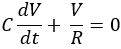
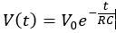
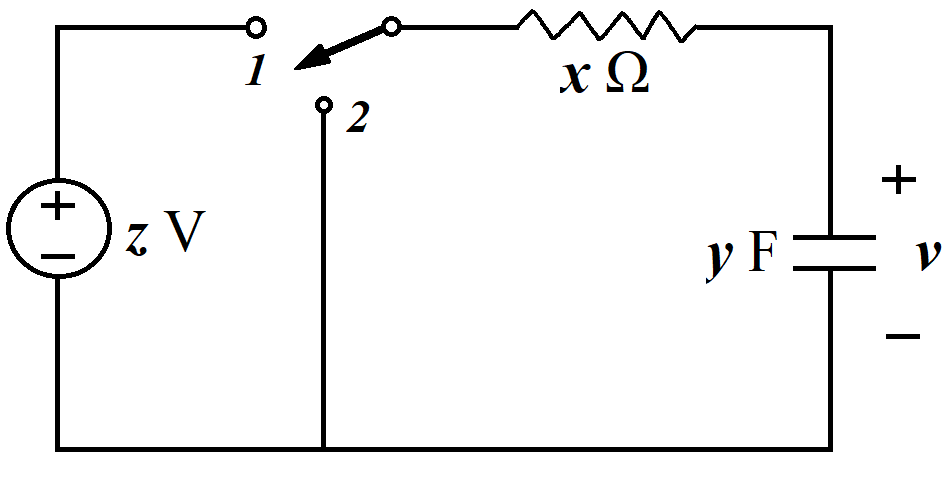

# RC circuit

Solve the linear differential equation of a RC circuit:\

\
and the solution:\

\
The RC circuit looks like:\

When the switch is on position 1, the circuit is in a transient state and the current will be 0 while the capacitor voltage(*Vc*) is equivalent to the power voltage(*V0*), which is *zV*\
The speed that current or voltage drops is determined on the RC time constant *T*\
When *t* = *RC* = *T*, *Vc* = 0.368*V0*\
When *t* = 2*RC* = 2*T*, *Vc* = 0.135*V0*\
When *t* = 3*RC* = 3*T*, *Vc* = 0.05*V0*\
According to the above calculation *Vc* has dropped down to 5% when *t* = 3*T*\
so we can assume that *Vc* = 0 when *t* >= 5*T*, which means the capacitor has fully discharged

## Executed result
```
> py .\rc.py
V0(V): 5
Resistor(kΩ): 25
Capacitor(μF): 4
25 4
T =  0.09999999999999999
t = 0:
Vc = 5.0 V, i = 0.2 mA
t = 1:
Vc = 1.839 V, i = 0.074 mA
t = 2:
Vc = 0.677 V, i = 0.027 mA
t = 3:
Vc = 0.249 V, i = 0.01 mA
t = 4:
Vc = 0.092 V, i = 0.004 mA
t = 5:
Vc = 0 V, i = 0.0 mA
t = 6:
Vc = 0 V, i = 0.0 mA
```

## Resolution function def rcV(v0, t)

```py
def rcV(v0, t):
    if t >= 5:
        return 0

    return float(v0 * exp(-t))
```
