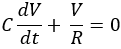

# RC circuit linear differential equation solution with sympy
Solve the equation:\

\
and the solution:\


## Executed result
v(t) = exp((C1 - t/R)/C)
```
> py .\rcDiff.py
Eq(v(t), exp((C1 - t/R)/C))
```

## Code in python
Construct the equation and store in *a*\
Then solve the equation using dsolve()
```py
from sympy import symbols, dsolve, Function

v = Function('v')
c, r, t = symbols('C R t')

a = c * v(t).diff(t)
a += v(t)/r

print(dsolve(a, v(t)))
```
\
The code returns:
```
Eq(v(t), exp((C1 - t/R)/C))
```
\
which is:\

\
and is equivalent to:\

\
It is the same as:\

\
if we gave v(0) = V0
